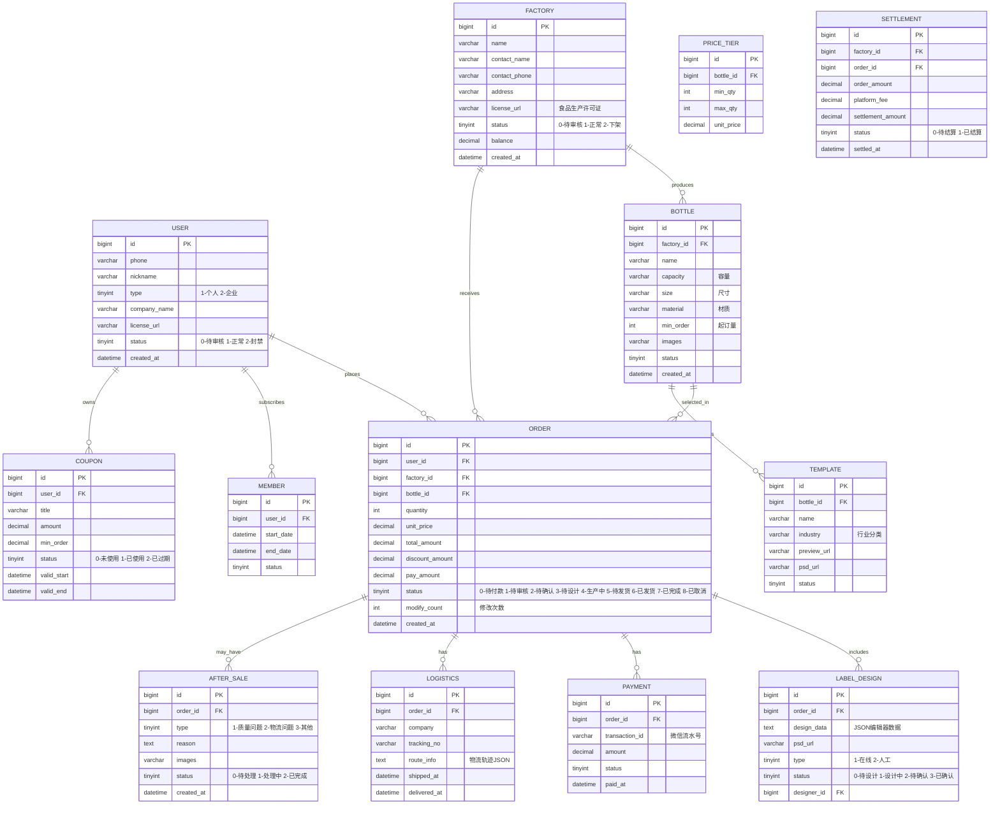

# 桂林定制水平台 — 产品开发文档（PRD v1.0）

## 一、项目概述

| 项目 | 说明 |
|------|------|
| **项目名称** | 桂林定制水平台（暂定名） |
| **定位** | B2B/B2C信息撮合平台，连接桂林瓶装水水厂与全国定制水客户 |
| **核心业务** | 水源地选择 → 瓶型选择 → 在线标签设计 → 下单 → 水厂生产配送 |
| **目标用户** | 中小企业（会议/活动用水）、个人消费者（婚礼/生日等） |
| **客单价** | 0.8元 ~ 2元/瓶 |
| **盈利模式** | 平台抽成 + 标签设计费 + 年费会员（99元/年） |

---

## 二、用户角色与权限矩阵

| 角色 | 使用端 | 核心权限 |
|------|--------|---------|
| **终端客户** | 小程序 / H5 | 浏览水厂/瓶型、在线设计标签、下单支付、查看订单/物流、申请售后 |
| **水厂管理员** | PC后台 | 管理瓶型库、设置阶梯报价、接单/拒单、上传物流单号、查看报表、申请提现 |
| **平台运营方** | PC后台 | 用户/水厂审核、订单管理、财务管理、内容管理、数据统计、数据大屏 |
| **标签设计师** | PC后台 / 企业微信 | 接收设计任务、与客户沟通、上传设计稿 |

---

## 三、核心业务流程

### 3.1 客户下单主流程

```
┌─────────────┐    ┌─────────────┐    ┌─────────────┐    ┌─────────────┐
│  客户注册    │ → │ 选择水源地   │ → │  选择瓶型    │ → │ 在线设计标签 │
│  (需认证)   │    │  (水厂列表)  │    │ (尺寸/容量)  │    │ (编辑器/人工)│
└─────────────┘    └─────────────┘    └─────────────┘    └──────┬──────┘
                                                                  │
┌─────────────┐    ┌─────────────┐    ┌─────────────┐    ┌─────┴───────┐
│  水厂生产    │ ← │  水厂确认    │ ← │  平台审核    │ ← │  提交订单    │
│  贴标发货   │    │  产能(48h)  │    │ (合规/产能)  │    │  全款预付    │
└──────┬──────┘    └─────────────┘    └─────────────┘    └─────────────┘
       │
       ▼
┌─────────────┐    ┌─────────────┐
│  客户签收    │ → │  平台结算    │
│  确认收货   │    │  给水厂      │
└─────────────┘    └─────────────┘
```

### 3.2 订单状态机

```
待付款 → 待平台审核 → 待水厂确认 → 待标签确认 → 生产中 → 待发货 → 已发货 → 已完成
            ↓              ↓            ↓
         审核不通过     水厂拒单      设计超时
            ↓              ↓            ↓
         已取消(退款)   已取消(退款)   平台介入
```

### 3.3 标签设计流程

```
客户选择模板/上传背景图 → 在线编辑(文字/LOGO/位置/颜色) → 提交设计稿
                                                              ↓
                                                    ┌─────────────────┐
                                                    │  复杂度判断     │
                                                    └────────┬────────┘
                                                             │
                                    ┌────────────────────────┼────────────────────────┐
                                    ▼                        ▼                        ▼
                              [简单排版]                [复杂排版/特殊工艺]           [客户满意]
                                    │                        │                        │
                                    ▼                        ▼                        ▼
                              直接生成PSD               转设计师人工对接            锁定下单
                              (含出血线/裁切线)           (企业微信沟通)            进入生产流程
```

**增强版在线设计器功能**：

| 功能模块 | 详细功能 |
|----------|----------|
| **模板市场** | 8+预设模板（商务/婚礼/活动/庆典分类）、一键应用 |
| **拖拽编辑** | 元素自由定位、实时预览、大小调整、删除/复制 |
| **图层管理** | 可视化图层列表、置顶/置底操作、快速选择 |
| **历史记录** | 撤销/重做支持、50步历史记录 |
| **文字工具** | 字体选择、字号调整、颜色选择、对齐方式 |
| **形状工具** | 矩形/圆形/线条、背景填充、边框设置 |
| **图片上传** | 支持JPG/PNG/SVG、本地预览 |
| **导出功能** | 导出PNG图片、本地保存设计 |

---

### 3.4 水厂入驻流程

```
水厂提交申请 → 上传资质(食品生产许可证等) → 平台人工审核 → 审核通过开通后台
                                                  ↓
                                              审核不通过
                                                  ↓
                                              通知补充材料
```

---

## 四、功能模块清单

### 4.1 客户端（小程序 + H5）

| 模块 | 功能点 | 优先级 |
|------|--------|--------|
| **首页** | 轮播Banner、水厂推荐、热销瓶型、营销活动入口 | P0 |
| **水厂广场** | 按城市筛选水厂列表、水厂详情页（资质展示、水源地介绍、评价） | P0 |
| **瓶型库** | 瓶型分类筛选、3D/多角度展示、尺寸容量参数、起订量、阶梯报价 | P0 |
| **标签编辑器** | 画布自适应瓶型尺寸、**模板市场**、**拖拽定位**、**图层管理**、**撤销/重做**、LOGO上传、文字编辑、背景图上传、实时预览、**导出PNG** | P0 |
| **订单中心** | 购物车、下单、支付、订单列表、订单详情、物流追踪、申请售后 | P0 |
| **我的** | 个人/企业信息、会员中心、优惠券、邀请好友、站内消息、帮助中心 | P1 |
| **营销** | 新用户首单优惠、限时秒杀活动页、团购拼单 | P1 |

### 4.2 水厂PC管理后台

| 模块 | 功能点 |
|------|--------|
| **首页看板** | 待处理订单数、今日订单金额、本月统计快捷入口 |
| **瓶型管理** | 新增/编辑/下架瓶型、上传瓶型图片、设置尺寸容量 |
| **报价管理** | 设置阶梯报价（数量区间-单价）、起订量设置 |
| **订单管理** | 接单/拒单、查看订单详情、上传物流单号 |
| **标签设计** | 接收人工设计任务、上传PSD源文件、与客户沟通 |
| **财务管理** | 订单收入统计、结算明细、提现申请（对公账户，3%手续费） |
| **数据统计** | 按日/月/年订单报表、热销瓶型分析 |

### 4.3 平台运营PC后台

| 模块 | 功能点 |
|------|--------|
| **首页数据大屏** | 实时订单数、今日GMV、水厂活跃度排名、客户地域分布、热销瓶型TOP10 |
| **用户管理** | 客户列表、水厂列表、账号审核、封禁/解封 |
| **水厂审核** | 资质审核（食品生产许可证）、入驻审批、定期复审提醒 |
| **订单管理** | 全量订单查看、平台审核、纠纷介入处理 |
| **标签模板库** | 按行业分类上传模板、模板上下架管理 |
| **营销管理** | 优惠券配置、秒杀活动创建、邀请返利规则设置 |
| **财务管理** | 平台收入统计、与水厂结算、会员费管理、提现审核 |
| **内容管理** | 帮助文档、公告发布、Banner配置 |
| **数据统计** | GMV、订单量、活跃水厂数、客户留存率、标签设计时效统计 |

---

## 五、关键业务规则

### 5.1 订单规则

| 规则项 | 说明 |
|--------|------|
| 下单前修改 | 水厂确认产能前，允许修改2次（瓶型、数量、标签内容） |
| 平台审核时效 | 接单后24小时内完成审核 |
| 水厂确认时效 | 48小时内确认产能，超时自动取消并退款 |
| 标签确认 | 客户在线确认后锁定，进入生产环节 |
| 支付方式 | 全款预付（微信支付） |
| 物流查询 | 接入微信小程序物流接口 |

### 5.2 会员规则（年费99元）

| 权益 | 说明 |
|------|------|
| 免标签设计费 | 简单排版免费，复杂排版仍需收费 |
| 更低抽成 | 抽成比例降低（具体比例运营后台配置） |
| 优先排产 | 订单优先进入水厂生产队列 |
| 专属客服 | 1对1企业微信客服对接 |

### 5.3 营销规则

| 活动 | 规则 |
|------|------|
| 新用户首单 | 满1000元减50元优惠券 |
| 邀请好友 | 邀请人获优惠券，被邀请人获新人礼包 |
| 限时秒杀 | 水厂报名参加，平台审核后上线 |
| 团购拼单 | 多个企业凑单达到更低单价 |

### 5.4 结算规则

| 项目 | 说明 |
|------|------|
| 客户付款 | 支付到平台账户 |
| 水厂结算 | 发货后结算，平台扣除抽成后转账 |
| 水厂提现 | 对公账户，3%手续费，最低提现金额可配置 |
| 售后处理 | 由水厂直接处理，平台可介入协调 |

---

## 六、数据库ER图（核心表结构）



---

## 七、API接口规划（关键接口）

| 模块 | 接口 | 说明 |
|------|------|------|
| **用户** | POST /api/user/register | 用户注册 |
| | POST /api/user/login | 手机号登录 |
| | PUT /api/user/company | 企业认证 |
| **水厂** | GET /api/factories | 水厂列表（按城市筛选） |
| | GET /api/factories/:id | 水厂详情 |
| **瓶型** | GET /api/bottles | 瓶型列表（按水厂筛选） |
| | GET /api/bottles/:id/prices | 阶梯报价 |
| **标签** | GET /api/templates | 标签模板列表 |
| | POST /api/designs | 提交设计稿 |
| | PUT /api/designs/:id/confirm | 确认设计稿 |
| **订单** | POST /api/orders | 创建订单 |
| | GET /api/orders | 订单列表 |
| | GET /api/orders/:id | 订单详情 |
| | PUT /api/orders/:id/modify | 修改订单（限2次） |
| | POST /api/orders/:id/pay | 订单支付 |
| **物流** | GET /api/orders/:id/logistics | 查询物流轨迹 |
| **营销** | GET /api/coupons | 优惠券列表 |
| | POST /api/coupons/claim | 领取优惠券 |
| **水厂后台** | GET /api/factory/orders | 水厂订单管理 |
| | PUT /api/factory/orders/:id/confirm | 确认接单 |
| | PUT /api/factory/orders/:id/reject | 拒绝接单 |
| | POST /api/factory/orders/:id/ship | 上传物流单号 |
| | GET /api/factory/settlements | 结算明细 |
| | POST /api/factory/withdrawals | 申请提现 |
| **运营后台** | GET /api/admin/dashboard | 数据大屏 |
| | PUT /api/admin/factories/:id/audit | 水厂审核 |
| | GET /api/admin/orders | 全量订单 |
| | POST /api/admin/templates | 上传标签模板 |
| | POST /api/admin/activities | 创建营销活动 |

---

## 八、开发排期建议（MVP版本）

| 阶段 | 周期 | 交付内容 |
|------|------|---------|
| **Phase 1: 基础框架** | 2周 | 用户系统、水厂入驻审核、瓶型库展示 |
| **Phase 2: 核心交易** | 3周 | 在线标签编辑器、下单支付、订单流程、物流接口 |
| **Phase 3: 后台系统** | 2周 | 水厂PC后台、运营PC后台、数据大屏 |
| **Phase 4: 营销增值** | 1周 | 会员系统、优惠券、邀请返利、秒杀活动 |
| **Phase 5: 测试上线** | 2周 | 全链路测试、Bug修复、小程序审核上线 |

**总计：约10周（2.5个月）**

---

## 九、风险提示与建议

| 风险点 | 建议 |
|--------|------|
| **水厂配合度** | 前期重点签约3-5家核心水厂，签订独家/优先合作协议 |
| **标签印刷质量** | 要求水厂提供印刷样品确认流程，建立质量抽检机制 |
| **版权纠纷** | 客户下单前强制签署电子协议，声明LOGO/图片合法使用权 |
| **产能波动** | 水厂后台设置产能日历，超产能时自动暂停接单 |
| **跨区域扩展** | 初期聚焦桂林，模式跑通后再向广西其他城市复制 |

---

## 十、市场需求调研报告（基于2025-2026行业分析）

### 10.1 市场规模与增长趋势

| 指标 | 数据 | 来源 |
|------|------|------|
| 2024年国内定制水市场规模 | **突破百亿元** | 网易订阅2026年报道 |
| 定制水年增长率 | **30%** | 多份行业报告 |
| 瓶装水整体市场规模(2025) | **超2680亿元** | 中研普华研究院 |
| 企业将定制水纳入年度营销预算比例 | **超65%** | 知乎专栏2025年报告 |

**结论**：定制水市场处于高速增长期，是瓶装水行业的重要细分赛道。

### 10.2 核心目标用户需求分析

#### 10.2.1 中小企业（B端）痛点

| 痛点 | 描述 | 解决方案 |
|------|------|----------|
| **品牌曝光需求** | 定制水作为"移动广告位"，会议/活动场景曝光价值高 | 提供专业标签设计工具，支持LOGO、水印、联系方式 |
| **采购效率低** | 传统电话/微信沟通流程繁琐，报价不透明 | 在线自助下单，阶梯报价自动计算 |
| **起订量门槛高** | 大厂起订量高，中小企业难以承受 | 支持小批量定制（如100瓶起），降低试错成本 |
| **设计能力弱** | 企业缺乏专业设计资源 | 提供行业模板库，在线编辑器支持快速排版 |
| **交付周期不确定** | 交期不稳定影响活动安排 | 产能日历展示，承诺48小时确认交期 |

#### 10.2.2 个人消费者（C端）需求

| 场景 | 需求 | 功能支持 |
|------|------|----------|
| 婚礼/生日宴 | 个性化定制（如新人照片、日期、祝福语） | 模板市场+图片上传 |
| 生日聚会 | 限量定制，社交分享 | 分享功能，订单追踪 |
| 纪念日 | 高端定制礼品 | 高端瓶型+礼盒包装选项 |

### 10.3 竞争对手分析

#### 10.3.1 现有市场玩家

| 品牌 | 定位 | 优势 | 劣势 |
|------|------|------|------|
| 农夫山泉/怡宝/哇哈哈 | 全国性品牌定制 | 品牌认知度高，水源优质 | 起订量高，价格不灵活，本地化服务弱 |
| 亲诚送水(长沙) | 区域性标杆 | 一站式解决方案，服务本地化 | 仅限区域，平台化程度低 |
| 清江尚品定制水 | 高端定制水 | 专业定制水厂家 | 主要B端，C端体验差 |
| 1688批发平台 | 多供应商撮合 | 供应商多，价格可选 | 无标准化服务流程，标签设计需自行解决 |

#### 10.3.2 差异化机会

1. **撮合平台模式**：打破单个水厂产能和地域限制，提供"一站式比价+下单"
2. **在线标签设计**：集成设计工具，降低用户设计门槛（竞品多依赖线下）
3. **本地化聚焦**：专注桂林优质水源地，塑造"桂林山水定制水"地域品牌
4. **小批量灵活**：支持100瓶以下小订单，填补市场空白

### 10.4 行业技术趋势

| 趋势 | 应用场景 | 建议引入时机 |
|------|----------|--------------|
| **AI标签设计辅助** | 智能配色、文案生成、模板推荐 | MVP后二期 |
| **3D瓶型预览** | 用户实时查看瓶型360°效果，提升下单信心 | MVP必做 |
| **产能智能调度** | 多水厂订单自动分配，产能优化 | MVP后一期 |
| **大数据分析** | 用户画像、热销预测、精准营销 | MVP后二期 |

### 10.5 印刷工艺与标签材质支持

根据行业标准，平台应支持以下标签工艺选项：

| 工艺类型 | 说明 | 适用场景 | 成本系数 |
|----------|------|----------|----------|
| **普通不干胶** | 铜版纸+覆膜，最基础 | 常规活动、会议 | 1.0x |
| **透明不干胶** | 透明材质，高级感 | 高端定制、品牌宣传 | 1.5x |
| **热收缩膜** | 360°包裹瓶身，视觉冲击强 | 特殊活动、节庆 | 1.8x |
| **防水耐磨** | 特殊涂层，适合户外 | 运动赛事、户外活动 | 1.3x |
| **烫金/烫银** | 高端工艺，提升档次 | 高端礼品、VIP客户 | 2.5x |
| **局部UV** | 图案凸起效果 | 品牌强调、logo突出 | 2.0x |

**建议**：在瓶型管理模块中增加"可选印刷工艺"配置项，水厂后台设置工艺类型和附加费用。

### 10.6 完善后的功能优先级建议

#### 新增P0优先级功能

| 功能 | 说明 | 优先级依据 |
|------|------|------------|
| **3D瓶型预览** | 弥补线上定制无法实物查看的痛点 | 显著提升下单转化率 |
| **小批量起订** | 100瓶起订，降低准入门槛 | 覆盖长尾中小企业客户 |
| **标签工艺选择** | 支持多种印刷工艺及附加费用 | 满足不同档次定制需求 |
| **产能日历** | 水厂设置可接单日期/数量 | 避免超负荷接单，提升履约体验 |

#### 新增P1优先级功能

| 功能 | 说明 | 优先级依据 |
|------|------|------------|
| **AI设计助手** | 智能配色、模板推荐、文案生成 | 降低设计门槛，提升用户体验 |
| **订单修改历史** | 记录订单修改节点，支持溯源 | 减少交易纠纷 |
| **水厂评分系统** | 客户评价+质量评分 | 建立信任机制，促进水厂提升服务 |
| **批量下单/复购** | 模板订单复制，常用配置保存 | 提升B端客户采购效率 |

#### 新增P2优先级功能（后续迭代）

| 功能 | 说明 |
|------|------|
| **企业采购账户** | 企业可创建部门/子账户，统一管理采购 |
| **SDK嵌入** | 支持企业官网/活动页面嵌入下单模块 |
| **API对接** | 支持ERP/CRM系统对接大型企业 |
| **区块链溯源** | 标签扫码显示水源地、生产日期等溯源信息 |

### 10.7 定价策略优化建议

基于市场调研，建议采用更具竞争力的定价结构：

| 会员等级 | 年费 | 抽成比例 | 适用客户 |
|----------|------|----------|----------|
| **普通用户** | 免费 | 10% | 个人消费者、小订单 |
| **银牌会员** | 99元/年 | 7% | 中小企业，定制需求稳定 |
| **金牌会员** | 399元/年 | 5% | 定制量大的企业 |
| **企业定制** | 定制报价 | 3% | 超大客户，支持API对接 |

**会员权益差异化**：除抽成和设计费优惠外，增加：
- 专属客服响应速度（银牌1小时，金牌30分钟）
- 优先排产权
- 免费使用高级模板库
- 企业采购账户（子账户管理、审批流程）

### 10.8 合规与风险补充

| 风险 | 应对措施 | 建议新增 |
|------|----------|----------|
| **食品安全** | 水厂资质审核（SC生产许可证） | 证书有效期提醒、定期复审 |
| **标签版权** | 用户签署《标签内容授权承诺书》 | AI敏感内容识别（logo/肖像检测） |
| **虚假宣传** | 水源地信息真实性核验 | 水源检测报告公示 |
| **售后纠纷** | 明确的退换货政策 | 平台仲裁机制，72小时响应 |
| **数据安全** | 用户信息加密存储 | GDPR/个人信息保护合规 |

### 10.9 桂林本地化特色建议

| 特色 | 建议 |
|------|------|
| **桂林山水品牌** | 打"桂林好水"地理标志概念，区别于普通定制水 |
| **旅游场景定制** | 开发旅游纪念版、伴手礼版（景区/酒店/导游合作） |
| **政府接待用水** | 争取政府会议、接待的定制水采购 |
| **漓江文化元素** | 提供桂林山水、象鼻山等元素的标签模板 |
| **物流优势** | 桂林作为旅游城市，物流覆盖广西及华南有优势 |

---